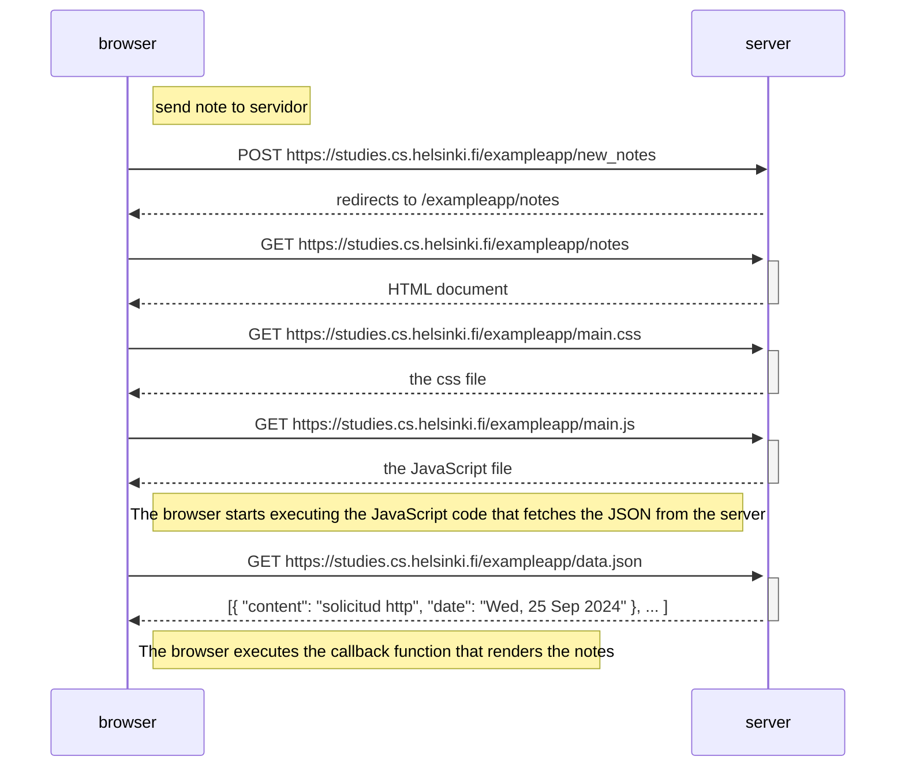

# Diagrama de nota
* Crea un diagrama similar que describa la situación en la que el usuario crea una nueva nota en la página https://studies.cs.helsinki.fi/exampleapp/notes escribiendo algo en el campo de texto y haciendo clic en el botón Save."


## Solución:



## Explicación:

* Envío de Nota (Solicitud HTTP POST):
El navegador inicia el proceso al realizar una solicitud HTTP de tipo POST a la URL https://studies.cs.helsinki.fi/exampleapp/new_note. Esta solicitud incluye los datos de la nota que el usuario ha creado, los cuales son enviados al servidor para su procesamiento.

* Recepción y Redirección por el Servidor:
Al recibir la solicitud, el servidor procesa los datos y, si todo es correcto, responde enviando una redirección a https://studies.cs.helsinki.fi/exampleapp/notes. Esta redirección indica al navegador que debe acceder a la página donde se muestran las notas.

* Solicitud del Documento HTML:
A continuación, el navegador realiza una solicitud GET a https://studies.cs.helsinki.fi/exampleapp/notes para obtener el documento HTML que contiene la estructura de la página.

* Solicitud del Archivo CSS:
Una vez que se recibe el documento HTML, el navegador solicita el archivo CSS desde https://studies.cs.helsinki.fi/exampleapp/main.css. Este archivo es fundamental para aplicar estilos visuales a la página y mejorar la experiencia del usuario.

* Solicitud del Archivo JavaScript:
Posteriormente, el navegador realiza otra solicitud GET para obtener el archivo JavaScript desde https://studies.cs.helsinki.fi/exampleapp/main.js. Este archivo contiene la lógica de programación necesaria para la funcionalidad interactiva de la aplicación.

* Solicitud del Archivo JSON:
Finalmente, el navegador solicita los datos en formato JSON a la URL https://studies.cs.helsinki.fi/exampleapp/data.json. Este JSON es crucial, ya que contiene la información sobre las notas que se mostrarán al usuario en la aplicación.
```
requests initiator chain:

- [https://studies.cs.helsinki.fi/exampleapp/new_note](https://studies.cs.helsinki.fi/exampleapp/new_note)
- [https://studies.cs.helsinki.fi/exampleapp/notes](https://studies.cs.helsinki.fi/exampleapp/notes)
- [https://studies.cs.helsinki.fi/exampleapp/main.css](https://studies.cs.helsinki.fi/exampleapp/main.css)
- [https://studies.cs.helsinki.fi/exampleapp/main.js](https://studies.cs.helsinki.fi/exampleapp/main.js)
- [https://studies.cs.helsinki.fi/exampleapp/data.json](https://studies.cs.helsinki.fi/exampleapp/data.json)
```
