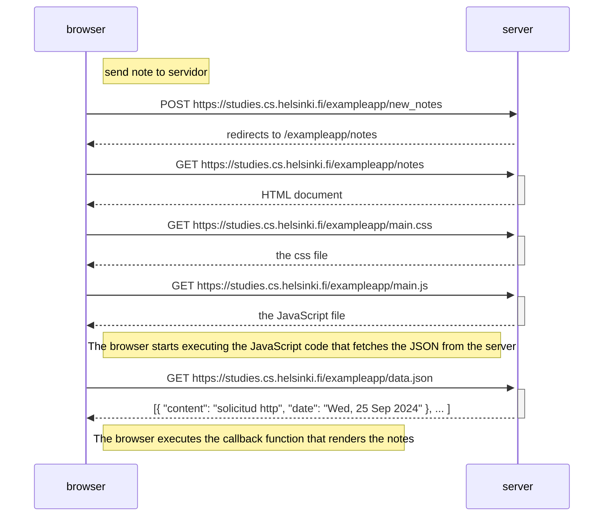

# Diagrama de nota
* Crea un diagrama similar que describa la situación en la que el usuario crea una nueva nota en la página https://studies.cs.helsinki.fi/exampleapp/notes escribiendo algo en el campo de texto y haciendo clic en el botón Save."


## Solución:



## Explicación:
* El navegador realiza solicitud http post, para enviar la nota que creo el usuario al servidor.
* El servidor recibe los datos y nos da una respuesta. Redirigiendo a exampleapp/note.
* El navegador solicita el archivo html.
* El navegador solicita el archivo css.
* El navegador solicita el archivo js.
* El navegador solicita el JSON.
```
- [https://studies.cs.helsinki.fi/exampleapp/new_note](https://studies.cs.helsinki.fi/exampleapp/new_note)
- [https://studies.cs.helsinki.fi/exampleapp/notes](https://studies.cs.helsinki.fi/exampleapp/notes)
- [https://studies.cs.helsinki.fi/exampleapp/main.css](https://studies.cs.helsinki.fi/exampleapp/main.css)
- [https://studies.cs.helsinki.fi/exampleapp/main.js](https://studies.cs.helsinki.fi/exampleapp/main.js)
- [https://studies.cs.helsinki.fi/exampleapp/data.json](https://studies.cs.helsinki.fi/exampleapp/data.json)
```
