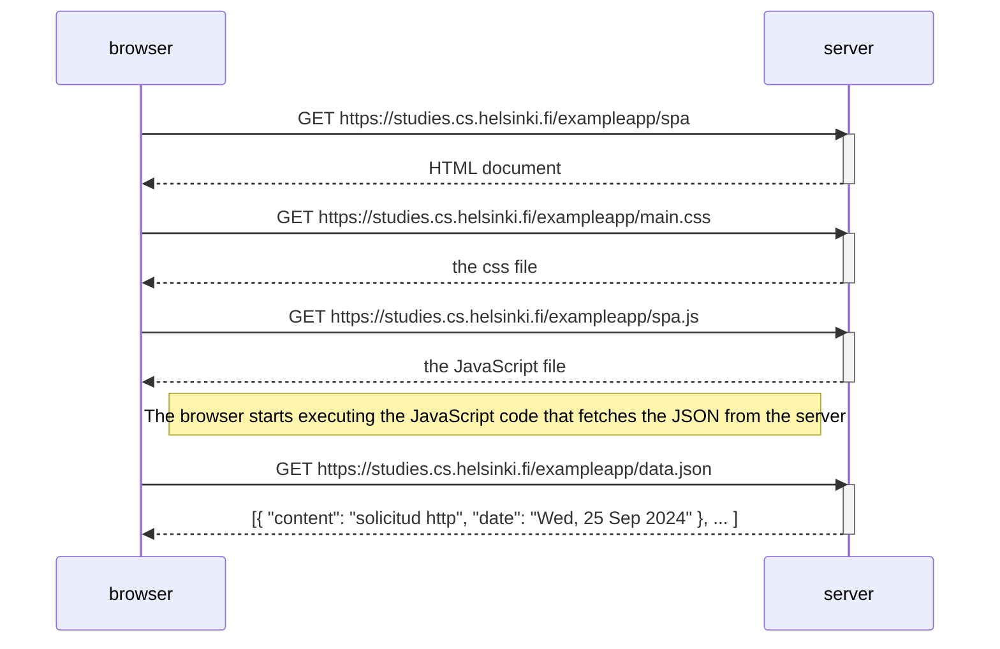

# Diagrama de aplicación de una sola página

- Crea un diagrama que describa la situación en la que el usuario accede a la versión de aplicación de una sola página de la aplicación de notas en https://studies.cs.helsinki.fi/exampleapp/spa.

## Solución:



## Explicación:

- `Solicitud del Documento HTML:`
  A continuación, el navegador realiza una solicitud GET a https://studies.cs.helsinki.fi/exampleapp/spa para obtener el documento HTML que contiene la estructura de la página.

- `Solicitud del Archivo CSS:`
  Una vez que se recibe el documento HTML, el navegador solicita el archivo CSS desde https://studies.cs.helsinki.fi/exampleapp/main.css. Este archivo es fundamental para aplicar estilos visuales a la página y mejorar la experiencia del usuario.

- `Solicitud del Archivo JavaScript:`
  Posteriormente, el navegador realiza otra solicitud GET para obtener el archivo JavaScript desde https://studies.cs.helsinki.fi/exampleapp/spa.js. Este archivo contiene la lógica de programación necesaria para la funcionalidad interactiva de la aplicación.

- `Solicitud del Archivo JSON:`
  El archivo JavaScript incluye código que, al cargarse, realiza una solicitud GET para obtener los datos en formato JSON desde https://studies.cs.helsinki.fi/exampleapp/data.json. Este archivo JSON contiene las notas que se mostrarán en la página. La SPA utiliza estos datos para actualizar dinámicamente el contenido en la interfaz de usuario sin recargar toda la página.

```
requests initiator chain:

- [https://studies.cs.helsinki.fi/exampleapp/spa](https://studies.cs.helsinki.fi/exampleapp/spa)
- [https://studies.cs.helsinki.fi/exampleapp/main.css](https://studies.cs.helsinki.fi/exampleapp/main.css)
- [https://studies.cs.helsinki.fi/exampleapp/spa.js](https://studies.cs.helsinki.fi/exampleapp/spa.js)
- [https://studies.cs.helsinki.fi/exampleapp/data.json](https://studies.cs.helsinki.fi/exampleapp/data.json)
```
