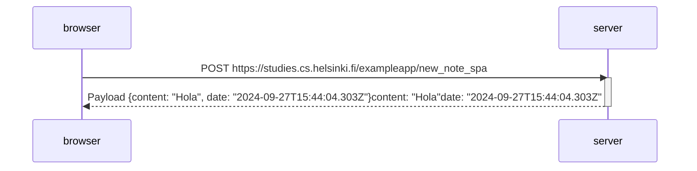

# 0.6: Nueva nota en diagrama de aplicación de una sola pagina
Crea un diagrama que represente la situación en la que el usuario crea una nueva nota utilizando la versión de una sola página de la aplicación.

Este fue el último ejercicio, y es hora de enviar tus respuestas a GitHub y marcar los ejercicios como hechos en el sistema de envío de ejercicios.

## Solución:

## Explicación

* `Interacción inicial:`   
El navegador envía una solicitud POST al servidor a la URL https://studies.cs.helsinki.fi/exampleapp/new_note_spa. Esta solicitud incluye los datos de una nueva nota que el usuario ha creado.

* `Respuesta del servidor:`   
El servidor procesa la solicitud y responde al navegador con un payload (o carga útil). En este caso, la respuesta contiene dos datos clave: el contenido de la nota ("Hola") y la fecha en la que se creó (2024-09-27T15:44:04.303Z).
